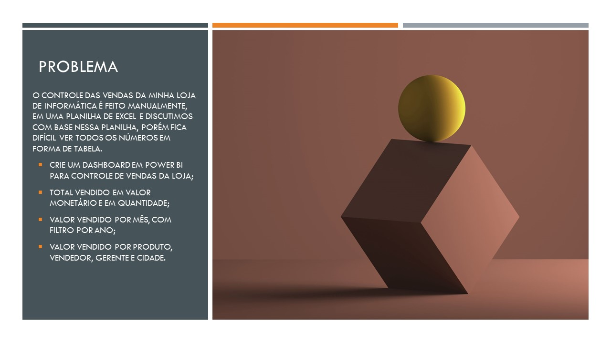

<h1 align="center">
  
</h1>

# CASE DELL POR CRISTIANE RODRIGUES

## Sobre o Projeto

Este é um projeto fictício que consiste na criação de um relatório em dashboard sobre o estoque de vendas de produtos de tecnologia para a Dell, durante o período de 2013 a 2017.

## Problema

## Solução

A solução do projeto encontra-se no arquivo PowerBI.

